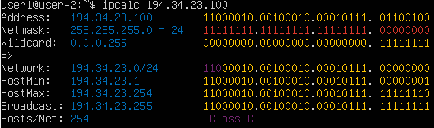
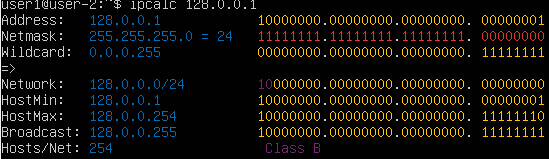
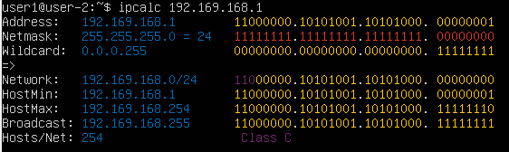
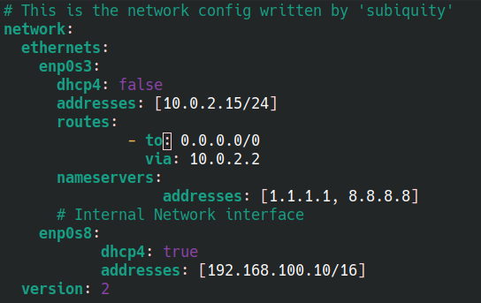
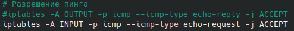
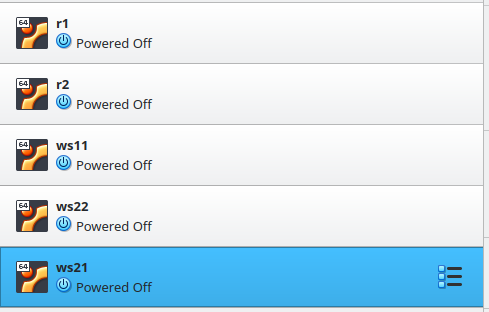
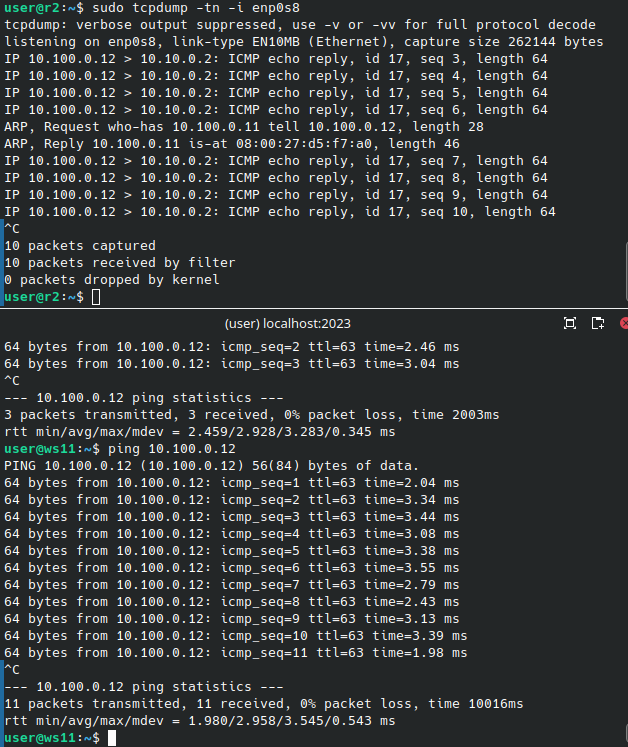

## Part 1. Инструмент ipcalc

### 1.1. Сети и маски

- Приватные **IP** адреса используются внутри локальных сетей
  - Примерный диапазон:
    - `10.0.0.0` - `10.255.255.255`
    - `172.16.0.0` - `172.31.255.255`
    - `192.168.0.0` - `192.168.255.255`
- Публичные **IP** адреса, назначаются **ISP (Internet Service Provider)**, используются для связи между устройствами в интернете

1. **Адрес сети** `192.167.38.54/13` является `192.160.0.0/13`, потому что первые 13 битов принадлежат сети

2. **Перевод маски**:

- `255.255.255.0`
  - Префиксная: `/24`
  - Двоичная: `11111111.11111111.11111111.00000000`
  - 

- `/15`
  - Обычная: `225.224.0.0`
  - Двоичная: `11111111.11111110.00000000.00000000`
  - 

3. Минимальный и максимальный хост `12.167.38.4`

- `/8`
  - HostMin: `12.0.0.1`
  - HostMax: `12.255.255.254`
  - 

- `11111111.11111111.00000000.00000000`
  - HostMin: `12.167.0.1`
  - HostMax: `12.167.255.254`
  - 

- `255.255.254.0`
  - HostMin: `12.167.38.1`
  - HostMax: `12.167.39.254`
  - 

### 1.2. localhost

- `192.34.23.100`
  - 
  - Не может подключиться к `localhost`
  - Утилита `ipcalc` не возвращает `loopback`

- `127.0.0.2`
  - 
  - Может обращаться к приложению, работающем на `localhost`
  - Утилита `ipcalc` возвращает `loopback`

- `127.1.0.1`
  - 
  - Может обращаться к приложению, работающем на `localhost`
  - Утилита `ipcalc` возвращает `loopback`

- `128.0.0.1`
  - 
  - Не может подключиться к `localhost`
  - Утилита `ipcalc` не возвращает `loopback`

### 1.3 Диапазоны и сегменты сетей

### Определение публичных и частных IP

- `10.0.0.45`
  - 
  - Частный

- `134.43.0.2`
  - 
  - Публичный

- `192.168.4.2`
  - 
  - Частный

- `172.20.250.4`
  - 
  - Частный

- `172.0.2.1`
  - 
  - Публичный

- `192.172.0.1`
  - 
  - Публичный

- `172.68.0.2`
  - 
  - Публичный

- `172.16.255.255`
  - 
  - Частный

- `10.10.10.10`
  - 
  - Частный

- `192.169.168.1`
  - 
  - Публичный

### Возможные шлюзы сети 10.10.0.0/18

- 
  - `10.0.0.1` - не может быть шлюзом, потому что это другая сеть
  - `10.10.0.2` - Может быть шлюзом 
  - `10.10.10.10` - может быть шлюзом
  - `10.10.100.1` - Не может быть шлюзом, потому что третий октет может быть максимально от 0 до 63, все что больше уже выходит за пределы сети 
  - `10.10.1.255` - Третий октет входит в часть сети, так что он может быть шлюзом

## Part 2. Статическая маршрутизация между двумя машинами

- `ip a` в `ws1`
  - 

- `ip a` в `ws2`
  - 

- Дополнительно добавляем по 1 сетевому интерфейсу `internal network` в `ws1` и `ws2`, с одним и тем же названием.
  - 

- `ws1` — 192.168.100.10 , маска /16
  - 
- `ws2` — 172.24.116.8 , маска /12
  - 

- Выполнение команды `netplan apply`
  - 
  - 

### 2.1. Добавление статического маршрута вручную

- Результат команд `ip r add` и `ping` для машины `ws1`
  - 
- Результат команд `ip r add` и `ping` для машины `ws2`
  - 

### 2.2. Добавление статического маршрута с сохранением

- Перезапуск обоих машин и проверка через `ip r`
  - 

- **note**: `optional:true` нужен чтобы система знала что сетевой интерфейс не критически важен, без этого машина долго включается

- Изменил `/etc/netplan/00-installer-config.yaml` в обоих машинах:
  - 

- Пинг обоих машин друг друга:
  - 

## Part 3. Утилита iperf3

### 3.1. Скорость соединения

- **8 Mbps в MB/s, 100 MB/s в Kbps, 1 Gbps в Mbps.**
  - 8 Mbps = 1 MB/s
  - 100 MB/s = 800,000 Kbps
  - 1 Gbps = 1000 Mbps

### 3.2. Утилита iperf3

- Чтобы использовать эту утилиту мне пришлось открыть порт `5201`, с помощью команды `sudo ufw allow 5201/tcp` и перезапустил брандмауэр `sudo ufw reload`

- Измерение скорости между `ws1` и `ws2`
  - 
    - Скорость соединение между машинами `359 MB/s`
  - На строне сервера, т.е `ws1` я использовал `sudo ipref3 -s -f M`
    - `-s` - server mode
    - `-f M` - format (MiB/s) делает вывод в Мегабайтах
    - По умолчанию открывает порт `5201`
  - На стороне клиента, т.е `ws2` я использовал `sudo ipref3 -c 192.168.100.10`
    - `-c` - client mode

## Part 4. Сетевой экран

### 4.1. Утилита **iptables**

- Сделал скрипт в `/etc/firewall.sh` в обоих машинах `ws1` `ws2`
  - Разрешаем порт `22` для `ssh` и порт `80` для `http`
  - 

- Для `ws1` Сначала запретим пинг, потом разрешим
  - 

- Для `ws2` Сначала разрешим пинг, потом запретим
  - 

- Запуск `firewall.sh` в `ws1`
  - 

- Запуск `firewall.sh` в `ws2`
  - 

- `@note`: Добавил порт 2022 вместо 22 чтобы подключиться по `ssh`, добавил еще порт 53 для `DNS`, без этого не устанавливало `nmap`

- В первой машине `ws1` я разрешил пинги, а во `ws2` запретил пинги 
  - В первой машине пришлось закоментировать `DROP` и оставить только `ACCEPT`, так-как правило `DROP` блокирует и потом правило `ACCEPT` не срабатывает, так-как правило `DROP` уже отбросил пинг
  - Еще пришлось изменить с `OUTPUT` на `INPUT`
  - 

### Утилита nmap

- Машина `ws2` не пингуется, но через `nmap` показывает что она запущена:
  - 
- Сделал `snapshots` машин:
  - 

## Part 5. Статическая маршрутизация сети

- Поднял 5 виртуальных машин с именами как в задании
  - 

### 5.1. Настройка адресов машин

- Конфигурация `etc/netplan/00-installer-config.yaml` машины `ws11`
  - 

- Конфигурация `etc/netplan/00-installer-config.yaml` машины `r1`
  - 

- Конфигурация `etc/netplan/00-installer-config.yaml` машины `r2`
  - 

- Конфигурация `etc/netplan/00-installer-config.yaml` машины `ws22`
  - 

- Конфигурация `etc/netplan/00-installer-config.yaml` машины `ws21`
  - 

- Вывод команды `ip -4 a` для каждой машины
  - 
  - 
  - 
  - 
  - 

- Пинг `ws22` с `ws21` 
  - 

- Пинг `r1` с `ws11`
  - 

### 5.2. Включение переадресации IP-адресов

#### Временная переадресация
- Использовал команду `sysctl -w net.ipv4.ip_forward=1` для обоих машин "роутеров"
  - 
  - 

#### Постоянная переадресация
- Изменение файла `/etc/sysctl.conf`
  - 

### 5.3. Установка маршрута по умолчанию

- Настройка шлюза по "умолчанию" для рабочих станций
  -  `ws11`
  -  `ws22`
  -  `ws21`
  - `UPD`: пришлось убрать `routes` для `enp0s3`, во всех рабочих станциях

- Вывод `ip r` для всех рабочих машин
  -  `ws11`
  -  `ws22`
  -  `ws21`

- Пропинговал `r2` с `ws11`
  - 

### 5.4. Добавление статических маршрутов

- Добавил статические маршрутизаторы для `r1`
  - 
  - `10.100.0.12` шлюз для доступа к сети `10.20.0.0/26`, этот маршрут указывает, как добравться до подсети `10.20.0.0/26`, через роутер `r2` 

- Добавил статические маршрутизаторы для `r2`
  - 
  - `10.100.0.11` - шлюз для доступа к сети `10.10.0.0/18`, используя роутер `r2`

- Мы используем сеть `10.100.0.0/16` чтобы соединить два роутера `r1`, `r2` и используем шлюз этой сети чтобы указать как добраться до других сетей

- Вывод команды `ip r` на обоих роутерах
  - 
  - 

- Вывод команды `ip r list 10.10.0.0/[маска сети] и ip r list 0.0.0.0/0` для машины `ws11` 
  - 

- Почему для адреса `10.10.0.0/[маска сети]` был выбран маршрут, отличный от `0.0.0.0/0`
  - По принципу `longest prefix match`, система выбирает наиболее спцифичный маршрут для адреса назначение
  - Маршрур `10.10.0.0/18` покрывает диапозон адресов от `10.10.0.0` до `10.10.63.255`, а маршрут покарывает все возможные адреса.
  - `10.10.0.0/18` является более специфичным, система использует именно этот маршрут для адресов в указанной подсети, игнорируя маршрут по умолчанию.
    - Более специфичные маршруты всегда имеют приоритет над маршрутами по умолчанию

### 5.5. Построение списка маршрутизаторов

- Вывод команды `tcpdump -tnv -i enp0s8`
  - 

- Вывод команды `traceroute -I 10.20.0.10`
  - 

- `tracerout` по умолчанию использует `UDP`
  - Отправляет пакеты с постепенно увеличивающимся `TTL(Time To Live)`
  - Каждый маршрутизатор уменьшает `TTL` на 1, если `TTL` становится равным 0, то отправляется `ICMP` сообщение `Time Exceeded`
  - По этим ответам `traceroute` определяет, через какие маршруты проходит путь.
  - Мы по заданию в фаерволе не включали `UDP`, но зато включали `ICMP`, поэтоу утилита `traceroute` используется с флагом `-I`.

### 5.6. Использование протокола ICMP при маршрутизации

- Пропинговали несуществующий `IP` с `ws11`
  - 

- Перехватываем с `r1` сетевой трафик, проходящий через `enp0s8`, используя команду `sudo tcpdump -n -i enp0s8 icmp`
  - 

- Сделал снэпшоты виртуальных машин
  - 

## Part 6. Динамическая настройка IP с помощью DHCP

- Установили `dhcp` сервер в `r2` с помощью команды `sudo apt install isc-dhcp-server` и изменили файл `/etc/dhcp/dhcpd.conf `
  - 

- Файл `/etc/reslov.conf` изменили так-же по заданию
  - 

- Перезапустил `isc-dhcp-server`
  - 

- Перезагрузил `ws21` и посмотрел получил ли он другой `IP`, как и ожидалось айпи изменилась с `10.20.0.10` на `10.20.0.2`, так же пропинговал `ws22`
  - 
  - Для этого пришлось изменить в `netplan` настройках `dhcp: true` поставить

- Добавил `macaddress: 10:10:10:10:10:BA` в `ws11` и изменил `dhcp4: true`
  - 

- Для `r1` изменил `/etc/dhcp/dhcpd.conf` и `/etc/resolv.conf`
  - 
  - 
  - 

- Перезагрузил `isc-ssh-server`
  - 

- Пришлось поменять файл `/etc/default/isc-dhcp-server`
  - 

- В `VB` поменял макадерес сетевого интерфейса который соединен с `r1`
- 

- Перезагурзил `ws11` и получил новый айпи адрес 
  - 

- `ws21` до запроса поменять `IP`
  - 

- Освободил `IP` через `sudo dhclient -r` и запросил новый через `sudo dhclient`
  - 
  - Как видно мы получили новый айпи адрес

- Сделал снепшоты всех пяти машин после выполнения 6 задания
  - 

## Part 7. NAT

- Изменил файл `/etc/apache2/ports.conf`
  -  
  - `r1`
  -  
  - `ws11`

- Запустил команду `service apache2 start`
  - 
  - `r1`
  - 
  - `ws22`

- Добавил фаерволл на `r2`
  - 
- Запустил файл `/etc/firewall.sh`
  - 

- Пинганул с `ws22` на `r1` 
  - 

- Добавляем правило чтобы разрешить маршрутизацию всех пингов `r2`
  - 

- Пинганул `r1` с `ws22`
  - 

- Включил SNAT на `r2` для маскировки всех локальных IP, находящейся за `r2`
  - 
    - `iptables -A FORWARD -p tcp --dport 80 -j ACCEPT` Добавляет правило в цепочку `FORWARD`, разрешающий пересылку пакетов TCP через порт 80
    - `iptables -A FORWARD -m state --state ESTABLISHED -j ACCEPT` Разрешает пересылку уже установленных соединений, важна для ответного трафика
    - `iptables -t nat -A POSTROUTING -s 10.20.0.0/26 -j SNAT --to-source 10.20.0.1` В таблице `nat` в цепочке `POSTROUTING` добавляется правило:
      - Все исходящие пакеты от подсети `-s 10.20.0.0/26` изменяют свой IP адрес источника на `10.20.0.1`
    - `iptables -t nat -A PREROUTING -p tcp --dport 8080 -j DNAT --to-destination 10.20.0.20:80`
      - В таблице `nat`, в цепочке `PREROUTING` добавляется правило:
        - Все входящие TCP-пакеты на порт `8080` перенаправляются на хост `10.20.0.20` на порт `80`

- После всех этих манипуляций я смог соединиться с помощью команды `telnet 10.100.0.11 80`, я так же отключил `NAT` интерфейс как советовали в задании
  - 
  - 

- Использовал команду `telnet 10.100.0.12 80` с `r1`
  - 

- Сделал снэпшот для всех 5 машин после 7 задания 
  - 

## Part 8. Дополнительно. Знакомство с SSH Tunnels

- Запустил тот же файл `/etc/firewall.sh` на `r2`
- Изменил файл `/etc/apache2/ports.conf`
  - 

- Сделал по `ssh-keygen` в `ws11` и `ws21` и вставил в файл `.ssh/authorized_keys` обе ssh ключа
  - Подключился через `ws21` к `ws22` используя команду `ssh -L 8080:localhost:80 user@10.20.0.20 -p 2022`
  - 

- Я проверил подключение с `ws21` к `ws22`
  - 
- Я не смог подключиться с `ws11` к `ws22`